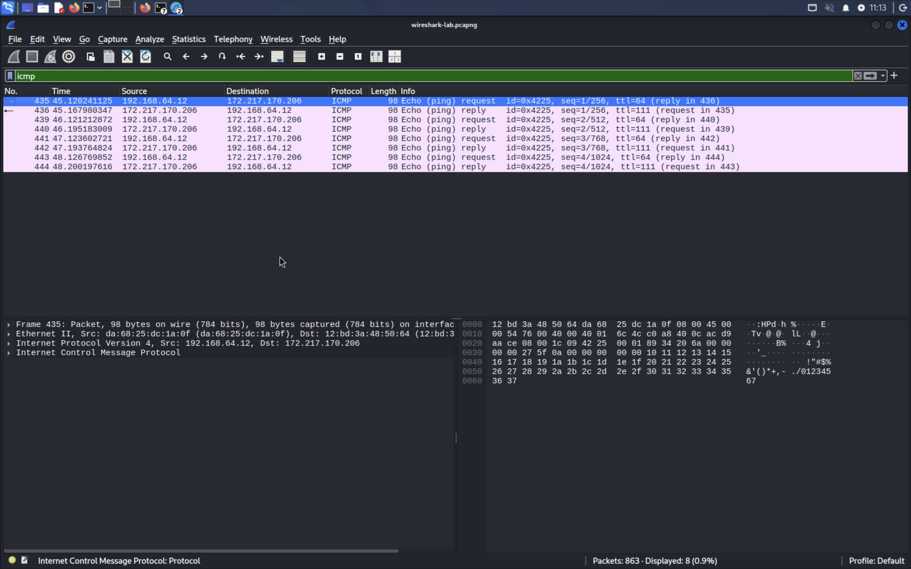
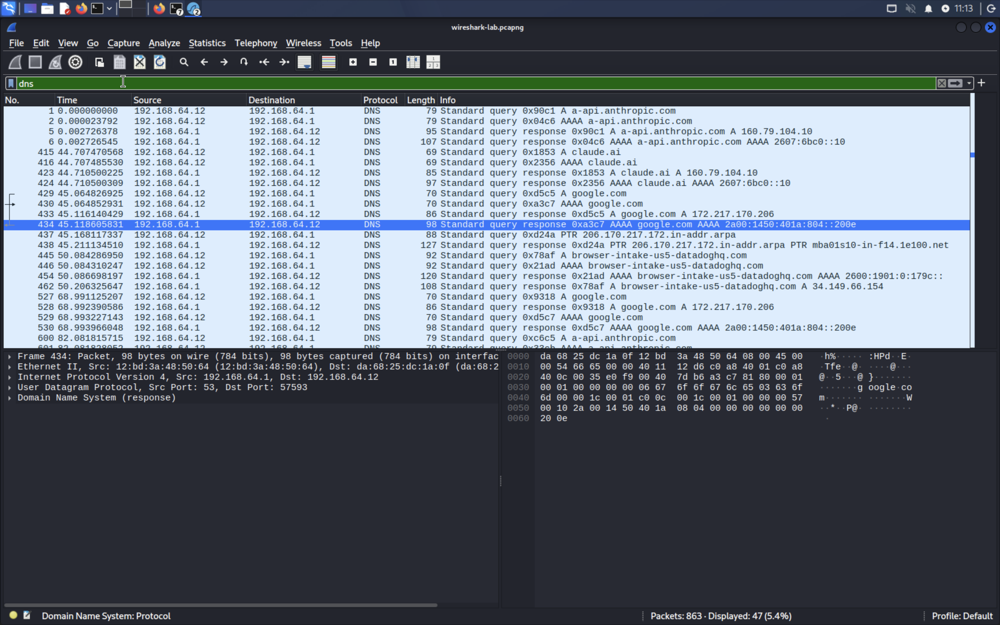
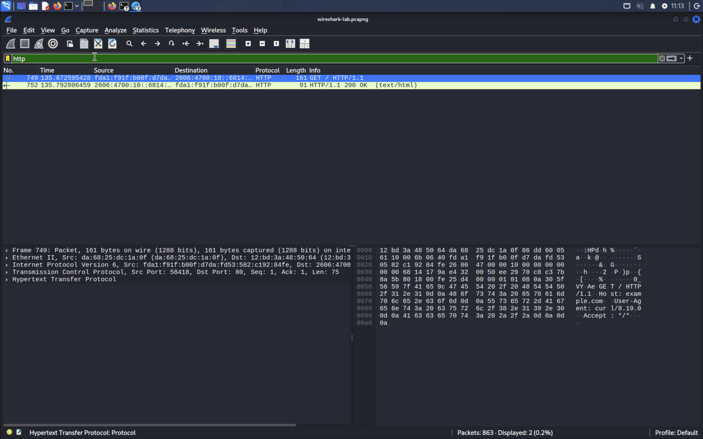

# Wireshark Packet Analysis Lab

## Overview
A beginner-level network traffic analysis lab performed on Kali Linux. This project demonstrates how to capture and analyze real network traffic using Wireshark, covering three core protocols: ICMP, DNS, and HTTP.

## Tools Used
- Wireshark
- Kali Linux (UTM on Apple M1)
- Terminal (ping, nslookup, curl)

## Lab Setup
- **Machine:** Kali Linux VM
- **Interface:** eth0
- **IP Address:** 192.168.64.12

---

## 1. ICMP Traffic Analysis
Generated ICMP traffic using `ping -c 4 google.com`.

**Findings:**
- Source: 192.168.64.12 (Kali machine)
- Destination: 172.217.170.206 (Google)
- 4 Echo requests and 4 Echo replies captured
- TTL: 64 (request), 111 (reply)

---

## 2. DNS Traffic Analysis
Generated DNS traffic using `nslookup google.com`.

**Findings:**
- DNS Server: 192.168.64.1
- Queries resolved for google.com, claude.ai, anthropic.com
- Both A (IPv4) and AAAA (IPv6) records observed
- 47 DNS packets captured total

---

## 3. HTTP Traffic Analysis
Generated HTTP traffic using `curl http://example.com`.

**Findings:**
- Source: Kali machine (port 58418)
- Destination: example.com (port 80)
- GET request sent and HTTP/1.1 200 OK response received
- Unencrypted traffic — payload visible in plain text

---

## Key Takeaways
- ICMP is used for network diagnostics (ping) — no port involved
- DNS resolves domain names to IP addresses before any connection is made
- HTTP traffic is unencrypted — sensitive data is visible in packet captures
- Always use HTTPS to protect data in transit

## Files
- `wireshark-lab.pcapng` — full packet capture file
